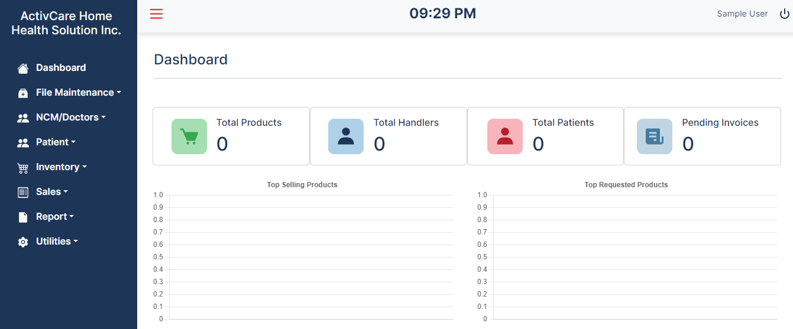
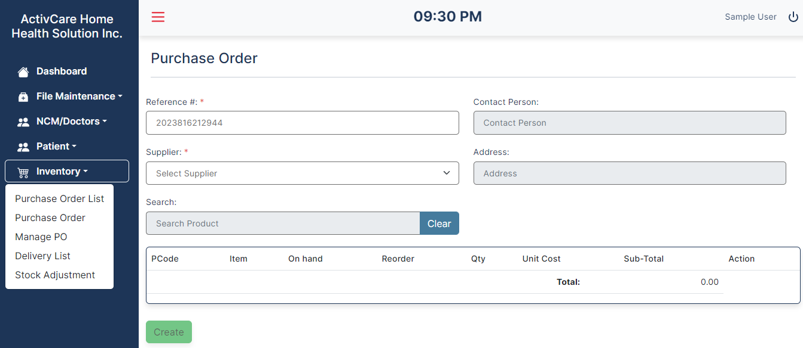
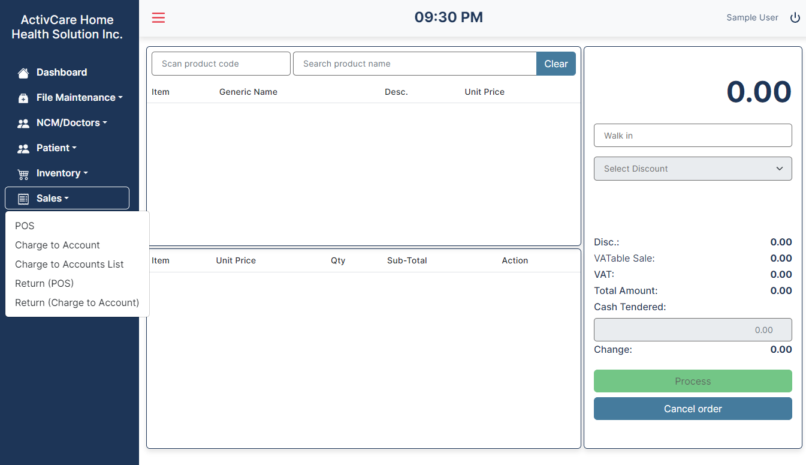
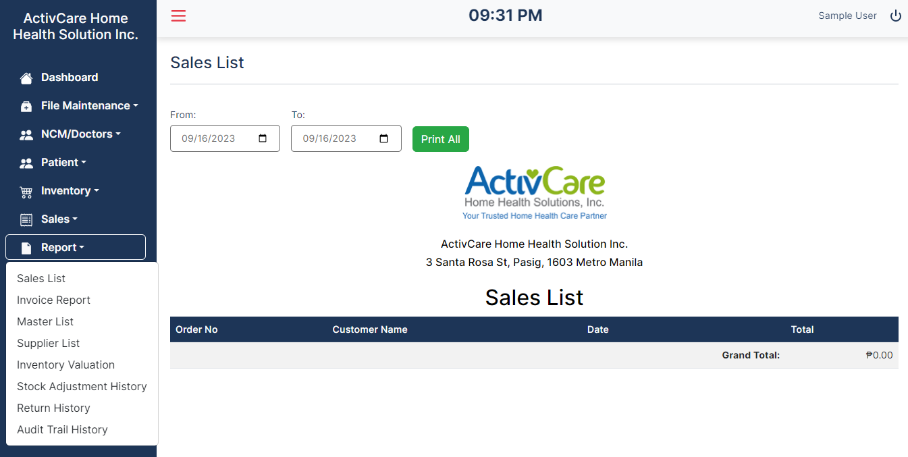

# Pharmacy Management System for ActivCare

## Screenshots

### Dashboard



### Inventory



### Sales



### Reports



> This is my thesis project for my last year in college.  
> I have started working on it in the month of Sept 2022 and finished it in the month of Jan 2023  
> Keep in mind that I worked on this on and off  
> I have 3 other group members, but I worked on it solo.

This is my first biggest project using ReactJs and it made me feel  
that I still need to learn more in order to be good at in something I want to do for the rest of my life.

## What I used

This project is made using:

- Bootstrap
- ReactJS
- Axios
- Sequelize

## Usage

> I wanted to deploy this application, but I don't have the money to keep the deployment of the server in heroku
> If you want to run it in your local machine, do the following steps

1. Make sure to download XAMPP or MySQL Workbench
2. Create a database named "pharmacy-management"
3. Create a user with the following login information
   > HOST: "localhost",  
   > USER: "root",  
   > PASSWORD: "root",
4. Navigate to client folder then run

```bash
npm install
npm run start
```

5. Navigate to server folder then run

```bash
npm install
npm run dev
```

> Use the this login credentials:  
> Username: admin  
> Password: administrator
